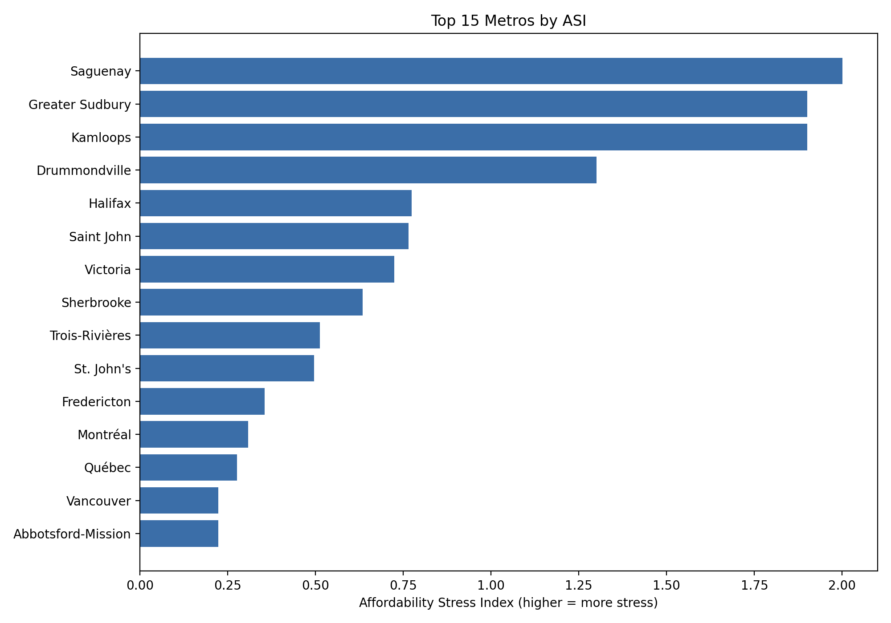
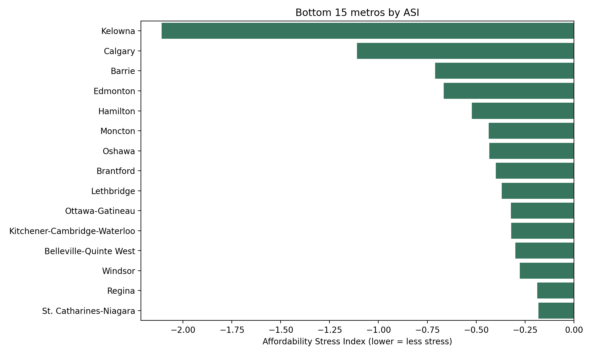
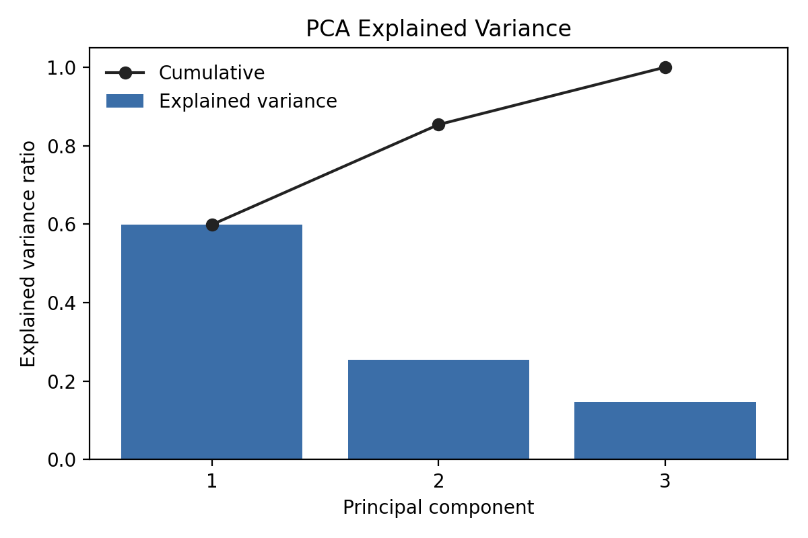
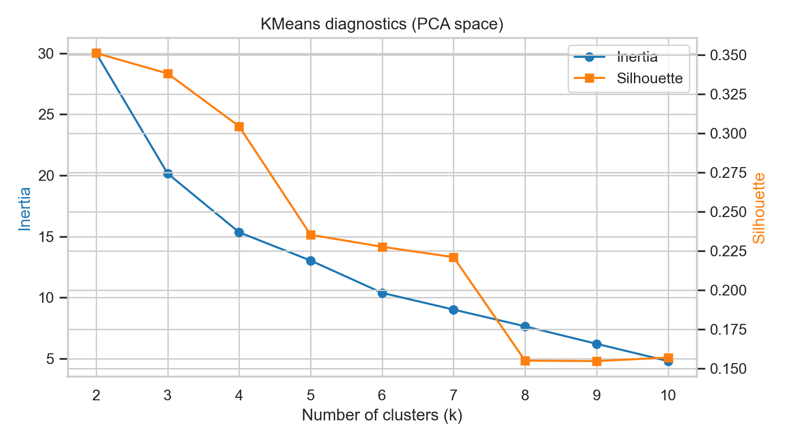
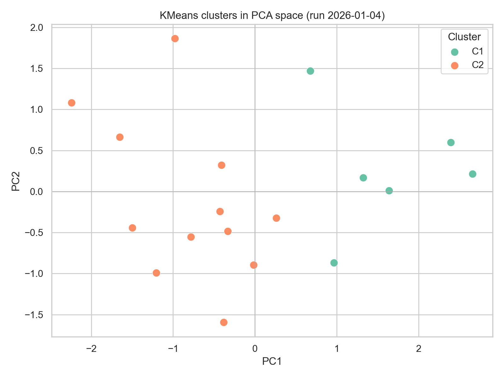
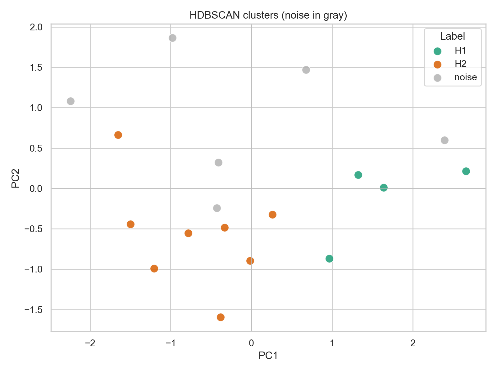
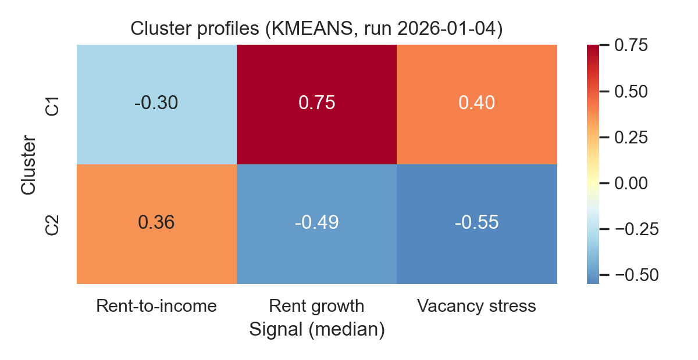

# Housing Affordability Stress Index – Portfolio Summary (As run on 4/1/26)

*Analyst*: Drew Harris

*Contact*: andrew.harris (at) torontomu.ca

## Motivation & Framing

Housing stress is a public-health and migration issue: renters who spend most of their paycheque on shelter defer medical care, while employers struggle to attract talent into high-cost metros. This project builds an Affordability Stress Index (ASI) to compare Canadian CMAs on three renter-facing signals—rent-to-income pressure, rent growth, and vacancy stress—so regional planners can identify which markets most urgently need supply, subsidies, or mobility support.

Imagine each metro as a household ledger. Rent-to-income is the share of pay devoted to shelter, rent growth is the yearly jump in the rent, and vacancy stress tells us how much buffer sits in savings or gets used for other things. When all three push the wrong way, the books do not balance and families cut elsewhere. The ASI simply tallies those line items so we can see, at a glance, which communities are already stretched and which still have breathing room. 

*Figure 1a. Halifax, Moncton, Kelowna, and other mid-sized metros top the ASI leaderboard, reflecting simultaneous rent spikes and lagging incomes.*

*Figure 1b. Edmonton, Regina, Winnipeg, and similar relief metros sit at the opposite end of the ASI ranking, signalling where vacancy slack and slower rent growth still provide breathing room.*

## Data & Methods

- **Sources** – Statistics Canada tables (income, CPI, labour force, population) and CMHC Rental Market Survey / Housing Starts feed the engineered feature set (details in `data_sources.md`).
- **Indexing** – `src/compute_asi.py` combines standardized stress signals into the ASI and publishes `data/processed/asi_scores.csv` plus Figure 1.
- **Dimensionality reduction** – `05_pca.ipynb` reprojects the signals into orthogonal PCs, documenting explained variance for transparency.
- **Segmentation** – `06_clustering.ipynb` runs both centroid-based (KMeans) and density-based (HDBSCAN) clustering to surface personas and noise metros, then exports labeled tables and profile heatmaps.

The Affordability Stress Index is the weighted mean of each metro’s scaled stress signals. For metro $m$ and stress features $f \in \mathcal{F}$ (rent-to-income, rent-growth, vacancy-stress), we drop any missing feature for that metro and re-normalize the remaining weights $w_f$ so they sum to one:

$$
\mathrm{ASI}_m = \frac{\sum_{f \in \mathcal{F}_m} w_f\, z_{m,f}}{\sum_{f \in \mathcal{F}_m} w_f}
$$

where $z_{m,f}$ is the robustly scaled value in `data/processed/features_scaled.csv`. In the current release all weights equal one, so each available signal contributes equally to the final score.

For a plain-language read: first we gather audited statements—trusted StatsCan and CMHC releases. Next we adjust every series so dollars, percentages, and ratios can sit on the same page. Finally we run stress tests, much like a central bank does for major lenders, to see which metros behave alike when pressure rises. Specialists can open each notebook to trace every calculation, while a time-strapped mayor or community advocate can rely on the figures to glean the headline story.

*Figure 2. PC1 captures the shared rent-to-income/vacancy pressure axis, while PC2 isolates high rent-growth metros.*

Reading Figure 2: PC1 alone absorbs roughly 60% of the total variance, which means a single blended pressure axis (tight vacancies plus high rent-to-income) already explains most differences among metros. Adding PC2 lifts cumulative coverage to about 90%, so plotting metros in two dimensions retains the rent-growth storyline without much information loss. PC3 accounts for the remaining ~10% and behaves like noise; if it spikes for a metro it usually signals sparse data or short-lived shocks rather than a new structural stress channel.

*Figure 3. Silhouette and inertia curves justify the selected K; the elbow occurs where silhouette remains high but inertia’s marginal gains flatten.*

## Cluster Narratives

KMeans now cleanly separates the metros into two personas, both of which show up in Figure 6 and the `data/processed/cluster_profiles.csv` export:

- **Cluster C1 – Rent-heat metros**: Median ASI sits at 0.40 because rent growth is +0.75σ and vacancy stress is +0.40σ even though rent-to-income is only −0.30σ. Halifax, Montréal, and Québec anchor this group—the core signal is that tight vacancies and accelerating rents are already overwhelming any modest relief from incomes.
- **Cluster C2 – Relief hubs**: Median ASI drops to −0.15, driven by simultaneous relief on vacancy stress (−0.55σ) and rent growth (−0.50σ). Rent-to-income is slightly above average (+0.36σ), but the softer market dynamics give policymakers headroom to direct migration or voucher programs toward Edmonton, Hamilton, and Kitchener-Cambridge-Waterloo.

Calling out “relief hubs” explicitly helps frame where pressure valves exist: metros qualify when their cluster medians for both vacancy stress and rent-growth signals fall below zero, indicating slack that can absorb renters from overheated regions without immediately recreating the same stress profile.

Think of Cluster C1 as a housing market stuck in perpetual rush hour: rents surge, vacancies vanish, and every new household is another car attempting to merge with no lane available. Cluster C2 feels more like a well-timed transit network: trains arrive often enough, there is space to board, and fares rise modestly. The statistical notes (σ shifts, medians, exemplars) stay intact for technical readers, while the traffic analogy keeps the stakes grounded in everyday experience.

*Figure 4. PC1/PC2 scatter colored by KMeans cluster, aligning with the personas above.*

*Figure 5. HDBSCAN highlights sparse metros (gray) that defy dense grouping—many are tourism or resource towns needing bespoke policies.*

*Figure 6. Persona heatmap summarizing median stress-signal loadings per cluster plus exemplar metros.*

Each heatmap value is the cluster median of the scaled signal from `data/processed/features_scaled.csv`. The scaling is robust: `(value - overall median) / IQR`, so `0` is a typical metro, `+1` is one IQR above median (more stress), and `-1` is one IQR below (less stress). Vacancy stress is the inverted vacancy rate, so higher numbers mean tighter markets.

## Limitations & Next Steps

- **Data lags** – StatCan/CMHC releases trail real time, so ASI should be regenerated each quarter; automation via Prefect/Airflow is on the backlog.
- **Scope** – Current signals focus on renters. Extending to ownership, evictions, or health outcomes will deepen the decision lens.
- **Sensitivity** – RobustScaler and leave-one-feature-out tests show most personas are stable, but single-feature metros can flip; future work should extend robustness checks to HDBSCAN and explore fuzzy clustering.
- **Causal links** – The ASI surfaces hotspots but does not estimate causal impacts on health or migration; integrating net-migration dashboards and health admin data is a natural next step.

Taken together, the ASI, PCA, and clustering workflow function like a central bank dashboard. Each gauge tracks a different form of pressure, but the power comes from reading them together before the warning lights turn into a crisis. The next phase is about tightening that dashboard—refreshing the data more quickly, adding homeownership and health gauges, and linking the readings to migration flows—so leaders can move from observation to intervention with confidence.
